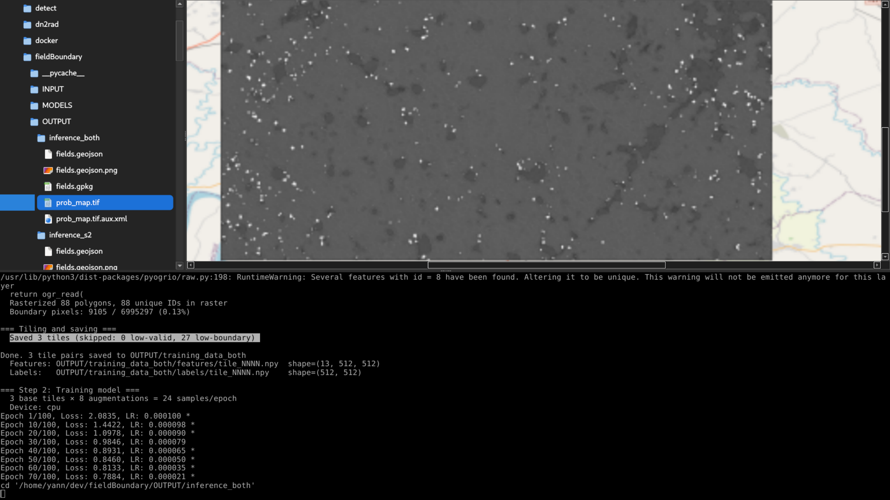

# Workspace

A Qt6-based desktop application featuring a file browser, image preview panel with GeoTIFF support, and an integrated terminal.



## Features

- **File Browser** - Navigate your home directory with a clean tree view
- **Image Preview** - View images with automatic scaling and aspect ratio preservation
- **Zoom & Pan** - Zoom in/out on images with scroll support when zoomed
- **GeoTIFF Support** - Load and display GeoTIFF files via GDAL with 2% histogram stretch
- **Integrated Terminal** - Built-in terminal panel for command-line operations
- **State Persistence** - Remembers your last folder and image between sessions
- **Dark Theme** - Modern dark UI inspired by GNOME Adwaita

## Keyboard Shortcuts

| Shortcut       | Action                          |
|----------------|----------------------------------|
| Ctrl++         | Zoom in                          |
| Ctrl+-         | Zoom out                         |
| Ctrl+0         | Reset zoom (fit to window)       |
| Ctrl+Shift+C   | Copy from terminal               |
| Ctrl+Shift+V   | Paste to terminal                |
| F5             | Refresh image display            |
| Ctrl+Q         | Quit application                 |

## Image Viewing

- **Fit to window**: Images automatically scale to fit the preview panel
- **Zoom in/out**: Use Ctrl++ and Ctrl+- to zoom (10% to 1000% range)
- **Pan**: When zoomed in, use scrollbars or mouse wheel to navigate
- **Reset**: Press Ctrl+0 to return to fit-to-window mode

## GeoTIFF Display

GeoTIFF files are rendered using GDAL with automatic contrast enhancement:

- **2% Histogram Stretch**: The lowest and highest 2% of pixel values are clipped, and the remaining range is stretched to the full 0-255 display range. This is the standard method used in QGIS and other GIS software for optimal visualization of thematic and continuous natural data.
- **Intelligent Band Selection**: For multi-band/hyperspectral images (in priority order):
  1. Uses GDAL color interpretation if bands are marked as Red/Green/Blue
  2. Searches for wavelength metadata (`wavelength`, `wl`, `lambda`, etc.) and selects bands closest to Red (665nm), Green (560nm), Blue (470nm)
  3. Falls back to well-spread bands avoiding noisy edge bands (first/last 5-10 bands)
- **Statistics Caching**: Automatically uses `.aux.xml` sidecar files if present:
  - Reads cached min/max/mean/stddev for fast histogram stretch computation
  - Approximates 2%/98% percentiles from statistics (no full pixel scan needed)
  - Creates `.aux.xml` files on first load for faster subsequent access
  - Falls back to pixel-based percentiles if statistics unavailable
- **NODATA Transparency**: Pixels with NODATA values (as defined in GeoTIFF metadata) are rendered transparent
- **RGB Support**: Multi-band (3+ bands) GeoTIFFs are displayed as RGB with per-band histogram stretch
- **Grayscale Support**: Single-band GeoTIFFs are displayed as grayscale with histogram stretch

## GeoJSON Display

GeoJSON vector files are rendered using GDAL/OGR:

- **Vector Rendering**: Points, lines, polygons, and multi-geometries are rendered with antialiasing
- **Automatic Scaling**: Rendering scales to fit extent, maximum 5000x5000 pixels
- **Preview Caching**: Rendered previews are cached as `.geojson.png` sidecar files
- **Cache Validation**: Sidecar previews are regenerated if source file is modified
- **Dark Theme**: Rendering uses blue fills/outlines on dark background matching the app theme

## Dependencies

- Qt6 (Core, Widgets)
- GDAL
- QTermWidget6
- X11, xkbcommon, xkbfile

## Quick Start

### Install from .deb (Debian/Ubuntu)

```bash
sudo dpkg -i workspace_1.0.0_amd64.deb
```

### Build from Source

```bash
./build.sh
./build/workspace
```

See [INSTALL.md](INSTALL.md) for detailed installation instructions.

## License

This project is provided as-is for personal use.
